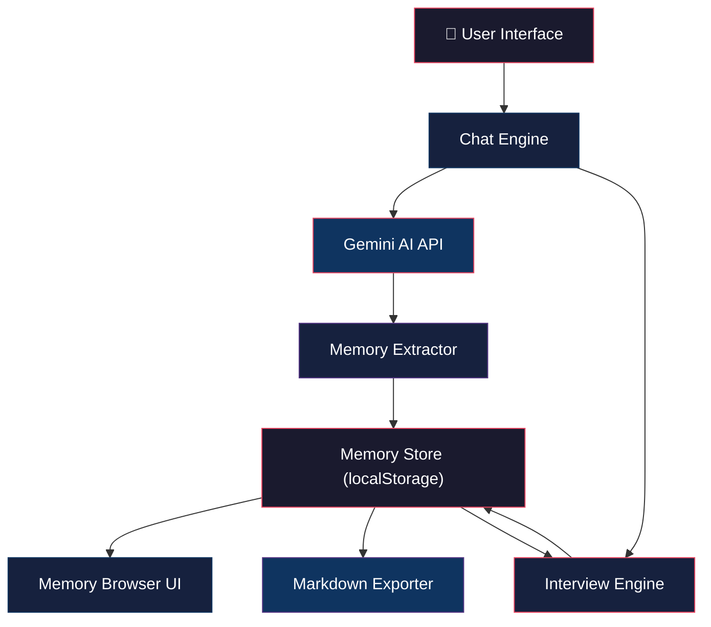

# Personal Memory — AI-Powered Digital Memory Web App

Build a premium, privacy-first web application that creates a structured digital memory of the user through intelligent AI-driven conversations. The memory is stored locally and exportable as portable Markdown files.

---

## User Review Required

> [!IMPORTANT]
> **AI Provider: Google Gemini API (Free Tier)**
> You'll need a free API key from [Google AI Studio](https://aistudio.google.com/). No credit card needed. The key is stored only in your browser's localStorage — it never leaves your machine. Since this is a personal, local-use app, browser-side API calls are acceptable.

> [!WARNING]
> **Privacy Notice**: Your API key and all memory data live exclusively in your browser's localStorage. Nothing is sent to any server except Google's Gemini API (for AI responses). If you clear browser data, you lose your memory — **always export backups as Markdown**.

---

## Open Questions

> [!IMPORTANT]
> **Color Theme Preference**: The plan uses a deep cosmic dark theme (dark navy/purple gradients with glowing accents). Would you prefer a different aesthetic direction?

> [!IMPORTANT]
> **Language**: The UI will be in English. Should it support any other languages?

---

## Architecture Overview



---

## Tech Stack

| Layer | Technology | Rationale |
|-------|-----------|-----------|
| **Build Tool** | Vite 6+ | Fast HMR, minimal config, native ES modules |
| **Language** | Vanilla JavaScript (ES2024+) | No framework overhead, maximum control |
| **Styling** | Vanilla CSS with custom properties | Full design system control, animations |
| **AI Engine** | `@google/genai` SDK | Official Google Gemini JS SDK, free tier |
| **Model** | `gemini-2.0-flash` | Free, fast, excellent for conversation |
| **Storage** | Browser localStorage | Fully private, zero server dependency |
| **Export** | Markdown files (`.md`) | Portable, human-readable, AI-parseable |
| **Fonts** | Inter + JetBrains Mono (Google Fonts) | Premium typography |

---

## Proposed Changes

### Component 1 — Project Scaffold & Design System

Set up the Vite project and establish the visual foundation.

#### [NEW] `package.json`
Vite + `@google/genai` dependency.

#### [NEW] `vite.config.js`
Minimal Vite config for vanilla JS.

#### [NEW] `index.html`
Root HTML with meta tags, font imports, semantic structure, and app mount point.

#### [NEW] `src/styles/index.css`
Complete design system:
- CSS custom properties (colors, spacing, typography, shadows, radii)
- Dark cosmic theme: deep navy `#0a0a1a` base, purple-pink accent gradients, glassmorphism panels
- Keyframe animations: fade-in, slide-up, pulse-glow, typing-indicator
- Responsive breakpoints
- Component-level styles for chat bubbles, cards, modals, buttons, navigation

---

### Component 2 — Core Application Shell

#### [NEW] `src/main.js`
Application entry point. Initializes router, renders initial view, loads stored state.

#### [NEW] `src/app.js`
Main application controller:
- View routing (onboarding → chat → memory browser → settings)
- Global state management
- Event bus for cross-component communication

#### [NEW] `src/router.js`
Simple hash-based SPA router. Views: `#welcome`, `#chat`, `#memory`, `#timeline`, `#settings`, `#export`.

---

### Component 3 — Onboarding & Welcome Experience

#### [NEW] `src/views/welcome.js`
First-run experience:
- Animated "Let's build your memory" hero with particle/star background
- Brief explanation of what the app does (3-step visual)
- API key input field with validation
- "Begin" button that transitions to the first interview
- Smooth entrance animations

---

### Component 4 — AI Engine & Gemini Integration

#### [NEW] `src/ai/gemini.js`
Gemini API wrapper:
- Initialize `GoogleGenAI` with stored API key
- `sendMessage(prompt, systemInstruction, history)` → response
- `extractMemories(conversation)` → structured memory candidates
- `generateQuestion(existingMemory, stage)` → next interview question
- Error handling, rate limit detection, retry logic

#### [NEW] `src/ai/prompts.js`
All system prompts and prompt templates:
- **Interviewer prompt**: Instructions for the AI to act as a thoughtful, empathetic interviewer
- **Memory extractor prompt**: Instructions to analyze conversation and output structured JSON memories
- **Question generator prompt**: Instructions to examine existing memory and generate the next meaningful question
- **Contradiction detector prompt**: Instructions to find conflicts in memory

---

### Component 5 — Intelligent Interview Engine

#### [NEW] `src/interview/engine.js`
Core interview logic:
- 7-stage progression system (Identity → Life → Personality → Relationships → Goals → Projects → Continuous)
- Stage tracking and completion detection
- Memory-aware question generation (reads existing memory before asking)
- Follow-up question logic (references previous answers)
- Gap detection (what's missing from each category)
- Contradiction detection (flags conflicting info for clarification)
- Adaptive pacing (doesn't overwhelm — 2-3 questions per session)

#### [NEW] `src/interview/stages.js`
Stage definitions:
- Each stage has: name, description, topic areas, seed questions, completion criteria
- Stage progression rules

---

### Component 6 — Chat Interface

#### [NEW] `src/views/chat.js`
Premium chat UI:
- Message bubbles with avatar indicators (user vs. AI)
- Typing indicator animation while AI responds
- Auto-scroll with smooth behavior
- Message timestamp display
- "Memory extracted" notification toasts when AI learns something
- Suggestion chips for quick responses
- Session history sidebar
- Input area with send button and keyboard shortcut (Enter)

#### [NEW] `src/chat/session.js`
Chat session management:
- Create/load/archive sessions
- Session metadata (date, stage, topics covered)
- Conversation history for Gemini context

---

### Component 7 — Memory Store & Data Model

#### [NEW] `src/memory/store.js`
Central memory storage engine:
- CRUD operations on memory entries
- localStorage persistence with versioned schema
- Memory schema:
  ```
  {
    id, category, subcategory, title, content,
    source: "interview" | "conversation" | "manual",
    confidence: "confirmed" | "inferred" | "needs_confirmation",
    createdAt, updatedAt, tags[], relatedMemories[]
  }
  ```
- Category index for fast lookups
- Change history tracking (what changed and when)
- Search across all memories

#### [NEW] `src/memory/categories.js`
Memory category taxonomy:
- **identity**: name, age, location, self-description, nationality, languages
- **life**: childhood, education, career, major_events, achievements, challenges, lessons
- **personality**: traits, strengths, weaknesses, habits, values, principles
- **preferences**: likes, dislikes, favorites, style_preferences
- **relationships**: family, friends, mentors, important_people, relationship_memories
- **goals**: current, career, financial, personal, dreams, learning_goals
- **projects**: current, past, skills, ideas
- **interests**: hobbies, topics, media, activities
- **knowledge**: expertise, opinions, beliefs, worldview
- **timeline**: dated events, milestones

---

### Component 8 — Memory Browser & Visualization

#### [NEW] `src/views/memory.js`
Visual memory explorer:
- Category cards with icons and entry counts
- Expandable category → subcategory → individual memories
- Memory cards with content preview, confidence badge, timestamp
- Search/filter bar
- Edit and delete capabilities
- "Needs confirmation" section highlighting uncertain memories
- Smooth accordion animations

#### [NEW] `src/views/timeline.js`
Chronological memory timeline:
- Visual vertical timeline with dated entries
- Life events plotted chronologically
- Zoomable sections (decade → year → month)
- Color-coded by category

---

### Component 9 — Markdown Export System

#### [NEW] `src/export/markdown.js`
Export engine:
- **Full export**: Single comprehensive Markdown file organized by category
- **Per-category export**: Individual `.md` files per category
- **AI-readable format**: Structured with YAML frontmatter + clear headings
- **Import**: Parse Markdown files back into memory entries
- Download as `.md` file(s) or `.zip` bundle

Example export format:
```markdown
---
exported: 2026-08-08
version: 1.0
categories: [identity, life, personality, ...]
total_memories: 47
---

# Personal Memory — [User Name]

## 🪪 Identity
### Name
Irene

### Location
[City, Country]

### Self-Description
[What they said about themselves]

## 🎯 Goals
### Financial Independence
- **Status**: Active goal
- **Definition**: [Their personal definition]
- **Timeline**: [If mentioned]
```

---

### Component 10 — Settings & Configuration

#### [NEW] `src/views/settings.js`
Settings panel:
- API key management (update/remove, with validation)
- Memory statistics dashboard (total memories, by category, last updated)
- Data management: clear all data, import backup, export backup
- Interview stage reset
- About section

---

### Component 11 — Navigation & Layout

#### [NEW] `src/components/sidebar.js`
Persistent sidebar navigation:
- App logo/branding
- Nav items: Chat, Memory, Timeline, Export, Settings
- Active state indicators
- Memory completion progress bar
- Collapsible on mobile

#### [NEW] `src/components/toast.js`
Notification toast system for memory extraction events, errors, and confirmations.

---

## File Structure

```
Memory app/
├── index.html
├── package.json
├── vite.config.js
├── public/
│   └── favicon.svg
├── src/
│   ├── main.js                    # Entry point
│   ├── app.js                     # App controller
│   ├── router.js                  # SPA router
│   ├── styles/
│   │   └── index.css              # Complete design system
│   ├── ai/
│   │   ├── gemini.js              # Gemini API wrapper
│   │   └── prompts.js             # All AI prompts
│   ├── interview/
│   │   ├── engine.js              # Interview logic
│   │   └── stages.js              # Stage definitions
│   ├── chat/
│   │   └── session.js             # Session management
│   ├── memory/
│   │   ├── store.js               # Memory CRUD & persistence
│   │   └── categories.js          # Category taxonomy
│   ├── export/
│   │   └── markdown.js            # Markdown export/import
│   ├── views/
│   │   ├── welcome.js             # Onboarding
│   │   ├── chat.js                # Chat interface
│   │   ├── memory.js              # Memory browser
│   │   ├── timeline.js            # Timeline view
│   │   └── settings.js            # Settings
│   └── components/
│       ├── sidebar.js             # Navigation sidebar
│       └── toast.js               # Toast notifications
```

---

## Design Direction

### Theme: "Cosmic Memory Vault"

| Token | Value | Usage |
|-------|-------|-------|
| `--bg-primary` | `#0a0a1a` | Main background |
| `--bg-secondary` | `#111128` | Cards, panels |
| `--bg-glass` | `rgba(17,17,40,0.7)` | Glassmorphism panels |
| `--accent-primary` | `#7c3aed` | Primary violet accent |
| `--accent-secondary` | `#e94560` | Rose-pink secondary |
| `--accent-gradient` | `linear-gradient(135deg, #7c3aed, #e94560)` | Buttons, highlights |
| `--text-primary` | `#e8e6f0` | Main text |
| `--text-secondary` | `#8b8aa0` | Muted text |
| `--success` | `#10b981` | Confirmed memories |
| `--warning` | `#f59e0b` | Needs confirmation |
| `--glow` | `0 0 20px rgba(124,58,237,0.3)` | Glow effects |

### Key Visual Effects
- Glassmorphism panels with `backdrop-filter: blur()`
- Subtle gradient borders on cards
- Particle/star animation on welcome screen
- Smooth page transitions (fade + slide)
- Typing indicator pulse animation
- Memory extraction "glowing orb" animation
- Category icons using emoji for universal support

---

## Verification Plan

### Automated Tests
```bash
npm run build    # Verify production build succeeds
npm run preview  # Verify production bundle serves correctly
```

### Manual Verification
1. **Onboarding flow**: First visit shows welcome → API key entry → first interview question
2. **Chat works**: Messages send, AI responds, typing indicator shows
3. **Memory extraction**: After answering questions, memory entries appear in Memory Browser
4. **Interview progression**: Questions adapt based on what's already known
5. **Memory browser**: All categories display, entries expandable, search works
6. **Timeline**: Dated memories appear chronologically
7. **Export**: Download produces valid, well-structured Markdown
8. **Import**: Previously exported Markdown re-imports correctly
9. **Persistence**: Refresh browser → all data persists
10. **Responsive**: Works on mobile viewports (≥375px)

---

## Implementation Order

1. **Phase 1**: Project scaffold, design system, navigation shell
2. **Phase 2**: Gemini AI integration, prompts, memory store
3. **Phase 3**: Welcome/onboarding experience
4. **Phase 4**: Chat interface + interview engine
5. **Phase 5**: Memory browser + timeline
6. **Phase 6**: Export/import system
7. **Phase 7**: Settings, polish, final testing
